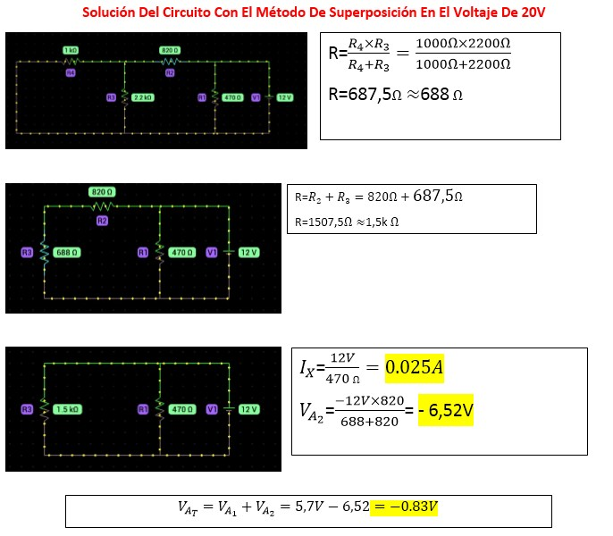

InformeLaboratorioNo4
==========================
# PRÁCTICA No. 4 TEOREMA DE SUPERPOSICIÓN 
1. OBJETIVOS
* 1.1 OBJETIVO GENERAL

Implementar el conocimiento de superposición tanto teóricamente y prácticamente con el uso de herramientas que le permitan diseñar circuitos de una forma digital con lo cual se analizara tanto los resultados calculados como simulados 

* 1.2 OBJETIVOS ESPECIFICOS
  * Analizar circuitos mediante superposición
  * diseñar circuitos de tal manera que se facilita su resolución 
  * similar circuitos mediante una herramienta digital 
  * Comparar resultados simulados y calculados 

2. REQUISITOS PREVIOS

Se requiere el análisis analítico del circuito mostrado en la figura 4.1., aplicando el Teorema de Superposición. Obtenga los valores de VA e IX, respetando tanto la   polaridad del voltaje como el sentido de la corriente que se proporcionan y anote los resultados en la tabla 4.1. y 4.2. según corresponda.

3. INFORMACION GENERAL 

Los simuladores de circuitos electrónicos son muy útiles para explicar el comportamiento de éstos de una forma asequible a los alumnos de la rama de Eléctrica y Electrónica. El uso de la simulación por ordenador es una herramienta imprescindible hoy en día a la hora de explicar la electrónica en el aula, al ser la forma más sencilla y rápida de comprobar el funcionamiento de un circuito. Además, no necesita ningún tipo de material adicional para el montaje del mismo o medida de los resultados.

4. MATERIAL Y EQUIPO REQUERIDO

| Cantidad | Elemento | 
| --------- | --------- | 
| 2 | Fuente de Voltaje de C.D. | 
| 2 | Multímetros Digitales | 
| 1 | Resistor de 1 KΩ |
| 1 | Resistor de 2.2 kΩ | 
| 1 | Resistor de 820 Ω |
| 1 | Resistor de 470 Ω |
| 1 | Protoboard |

5. PROCEDIMIENTO

### 5.1 Arme el circuito que se presenta en la figura 4.1.

 
 
Figura 4.1. Circuito para comprobar el Teorema de Superposición.

### 5.2 Con las dos fuentes conectadas, mida el voltaje VA y la corriente Ix, respetando la polaridad del voltaje como el sentido de la corriente que se proporcionan. Anote el valor de las mediciones en la tabla 4.1 y 4.2 respectivamente.

 Circuito en Multisim con las dos fuentes de voltaje.

 
 
### 5.3 Haga "cero" la fuente de voltaje de 12 V (V2) y mida el voltaje VA y la corriente Ix, respetando la polaridad del voltaje como el sentido de la corriente que se proporcionan. Anote el valor de las mediciones en la tabla 4.1 y 4.2 respectivamente.

Circuito con el teorema de superosición

 

### 5.4 Haga "cero" la fuente de voltaje de 20 V (V1) y mida el voltaje VA y la corriente Ix, respetando la polaridad del voltaje como el sentido de la corriente que se proporcionan. Anote el valor de las mediciones en la tabla 4.1 y 4.2 respectivamente.

Circuito con el teorema de superosición

 

### 5.5 Verifique el cumplimiento del Teorema de Superposición y compare los resultados obtenidos prácticamente con los obtenidos analíticamente. Realice sus conclusiones.

6. VIDEO

https://youtu.be/iGWKj78o0QY

7. CONCLUSIONES

 - Se pudo comprobar que los valores obtenidos de los voltajes como de las corrientes fueron muy semejantes a los obtenidos mediante verificar el circuito analiticamente, con unos pequeños margenes de error.
Asi mismo tanto para las tablas obtenidas, se comprobó el uso del teorema de superposición, mediante las ecuaciones encontradas, los cálculos obtenidos nos asemejan a una silmulación real, todo este proceso de usar la ley antes mencionadas nos permiten a que los valores sean precisos y casi exactos, apoyandonos del mismo ciruito para usar las fórmulas como la dirección de los voltajes y corrientes.

8. BIBLIOGRAFIA

Youtu.be. 2021. Before you continue to YouTube. [online] Available at: <https://youtu.be/AsjT9jO8new> [Accessed 14 July 2021].
